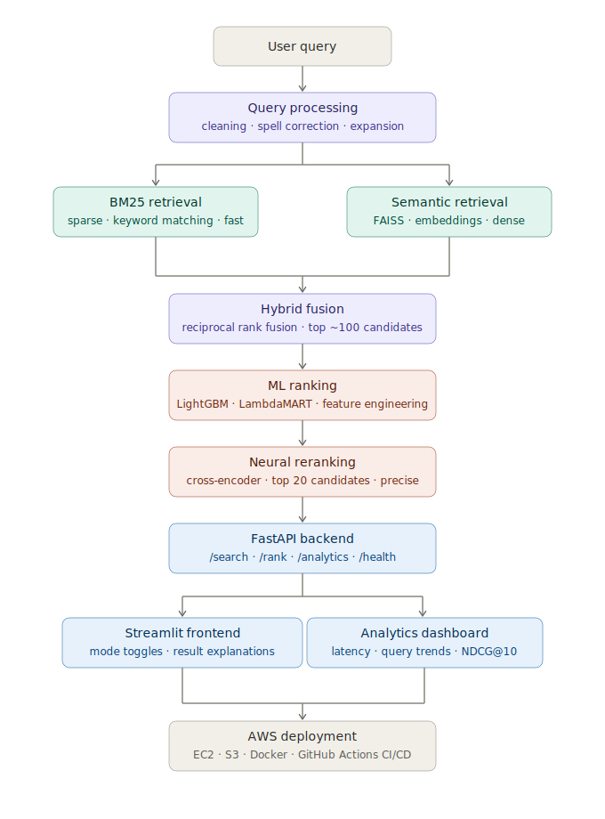

# Intelligent Search & Ranking System

A production-grade, multi-stage search and ranking platform built from first principles. Combines classical IR (BM25) with modern semantic search (FAISS + sentence embeddings) and ML ranking (LightGBM + cross-encoder reranking) into a single cohesive pipeline — the same architecture that underlies Google Search, LinkedIn, and enterprise knowledge bases.

Evaluated end-to-end on **MS MARCO** using **NDCG@10** across every pipeline stage.

---

## Table of Contents

1. [Project Overview](#project-overview)
2. [Architecture](#architecture)
3. [Pipeline Stages](#pipeline-stages)
4. [Evaluation Results](#evaluation-results)
5. [Repository Layout](#repository-layout)
6. [System Design Decisions](#system-design-decisions)
7. [Running Locally](#running-locally)
8. [Deployment](#deployment)
9. [API Reference](#api-reference)
10. [Key Design Decisions](#key-design-decisions)
11. [Future Enhancements](#future-enhancements)

---

## Project Overview

**What it is:** A modular retrieval and ranking system that processes a user query through five distinct stages — query processing, hybrid retrieval, ML ranking, neural reranking, and result serving — each independently benchmarked and replaceable.

**Why it's interesting:** Most search tutorials teach one thing — BM25, or embeddings, or an API. This project builds the full stack and measures exactly how much each stage improves result quality. The benchmark numbers are real, earned on MS MARCO, not simulated.

**What it teaches:** Information retrieval, vector search, learning-to-rank, evaluation methodology, REST API design, and cloud deployment — in one coherent system.

---

## Architecture



> A detailed architecture diagram is available in [`docs/architecture.png`](docs/architecture.png)

---

## Pipeline Stages

### Stage 1 — Query Processing

Cleans and normalizes the raw query. Handles lowercasing, punctuation, and basic spell correction. Prepares the query for both sparse and dense retrieval paths.

### Stage 2 — BM25 Retrieval (Sparse)

Keyword-based retrieval using BM25 (Best Match 25). Fast and interpretable. Strong for exact keyword matches, weak on synonyms and semantic intent. Implemented with `rank_bm25` over the MS MARCO passage corpus.

### Stage 3 — Semantic Retrieval (Dense)

Encodes queries and documents into embedding space using `sentence-transformers`. Approximate nearest neighbor search via FAISS. Captures semantic similarity that BM25 misses entirely.

### Stage 4 — Hybrid Retrieval

Combines BM25 and semantic scores using Reciprocal Rank Fusion (RRF). Almost always outperforms either retrieval method alone. Produces a candidate set of ~100 documents for the ranking layer.

### Stage 5 — ML Ranking (LightGBM)

Extracts features per (query, document) pair — BM25 score, cosine similarity, document length, query term coverage, recency. Trains a LightGBM ranker using LambdaMART on MS MARCO relevance labels. Learning-to-rank, not classification.

### Stage 6 — Neural Reranking (Cross-Encoder)

Applies a cross-encoder model that jointly encodes the query and each candidate document for fine-grained relevance scoring. Slower but more accurate than bi-encoder approaches. Applied only to the top candidates from ML ranking.

### Stage 7 — Serving

FastAPI backend exposes `/search`, `/rank`, and `/analytics` endpoints. Streamlit frontend with mode toggles (BM25 / semantic / hybrid) and result explanations. Deployed on AWS EC2 (free tier) with model artifacts stored in S3.

---

## Evaluation Results

All stages evaluated on MS MARCO passage ranking using **NDCG@10**.

|   Stage   |          Method          | NDCG@10 |
|-----------|--------------------------|---------|
|  Baseline |         BM25 only        |  *TBD*  |
|  Stage 3  |       Semantic only      |  *TBD*  |
|  Stage 4  | Hybrid (BM25 + Semantic) |  *TBD*  |
|  Stage 5  |  +ML Ranking (LightGBM)  |  *TBD*  |
|  Stage 6  |    + Neural Reranking    |  *TBD*  |

> Numbers will be filled in as each stage is built and benchmarked. See [`docs/Evaluation.md`](docs/Evaluation.md) for full benchmark writeup.

---

## Repository Layout

```text
intelligent-search-ranking/
├── .github/
│   └── workflows/          # CI/CD — lint, test, deploy
├── docs/
│   ├── architecture.svg    # System architecture diagram
│   ├── SystemDesign.md     # Architectural decisions and tradeoffs
│   └── Evaluation.md       # Full benchmark results and analysis
├── data/
│   └── README.md           # How to obtain MS MARCO, what subset we use
├── src/
│   ├── retrieval/          # BM25, FAISS, hybrid retrieval
│   ├── ranking/            # Feature extraction, LightGBM ranker
│   ├── reranking/          # Cross-encoder reranker
│   ├── api/                # FastAPI application
│   └── pipeline/           # End-to-end orchestration
├── frontend/               # Streamlit UI
├── evaluation/             # NDCG scripts, stage benchmarking
├── notebooks/              # Exploratory analysis (numbered)
├── deployment/
│   ├── docker-compose.yml
│   └── aws/                # EC2 and S3 configuration
├── tests/                  # Unit and integration tests
├── DataContracts.md        # API contracts between pipeline components
├── pyproject.toml          # Dependencies managed with uv
└── README.md
```

---

## System Design Decisions

Full rationale documented in [`docs/SystemDesign.md`](docs/SystemDesign.md). Key decisions:

- **BM25 before embeddings** — BM25 is fast, interpretable, and a strong baseline. Understanding where it fails motivates the semantic layer.
- **Reciprocal Rank Fusion over learned fusion** — RRF requires no training data, is robust to score scale differences, and performs surprisingly well in practice.
- **LightGBM over XGBoost for ranking** — LightGBM's GBDT implementation is faster to train and has native LambdaMART support.
- **Cross-encoder only at reranking stage** — Cross-encoders are too slow to run over the full corpus. Applied only to the top ~20 candidates after ML ranking.
- **FastAPI over Flask** — Async-native, automatic OpenAPI docs, Pydantic validation built in.
- **Free-tier AWS deployment** — EC2 t2.micro for serving, S3 for model artifact storage. Cost-aware architecture from day one.

---

## Running Locally

### Prerequisites

- Python 3.11+
- [uv](https://github.com/astral-sh/uv) package manager
- Docker (for full stack)

### Setup

```bash
git clone https://github.com/Reddi2802/intelligent-search-ranking.git
cd intelligent-search-ranking

uv venv
source .venv/bin/activate  # Windows: .venv\Scripts\activate

uv sync
```

### Run the API

```bash
uvicorn src.api.main:app --reload
```

### Run the Frontend

```bash
streamlit run frontend/app.py
```

### Run with Docker

```bash
docker-compose up
```

---

## Deployment

Deployed on **AWS EC2 (t2.micro)** with model artifacts stored in **AWS S3**.

> Deployment instructions and infrastructure setup in [`deployment/aws/`](deployment/aws/).

Live endpoint: *TBD*

---

## API Reference

Full contracts documented in [`DataContracts.md`](DataContracts.md).

|   Endpoint   | Method |            Description            |
|--------------|--------|-----------------------------------|
|   `/search`  |  POST  |      Run full pipeline search     |
|    `/rank`   |  POST  |  Rerank a provided candidate set  |
| `/analytics` |   GET  | Query trends, latency percentiles |
|   `/health`  |   GET  |        Service health check       |

---

## Key Design Decisions

See [`docs/SystemDesign.md`](docs/SystemDesign.md) for the full reasoning behind every architectural choice — why each tool was chosen over its alternatives, what tradeoffs were made, and what was deliberately left out of scope.

---

## Future Enhancements

- Query expansion using embedding-based synonym generation
- Click-through feedback loop for implicit relevance signals
- Distributed FAISS for larger corpora
- Terraform-based AWS infrastructure
- A/B testing framework for ranking model experiments
